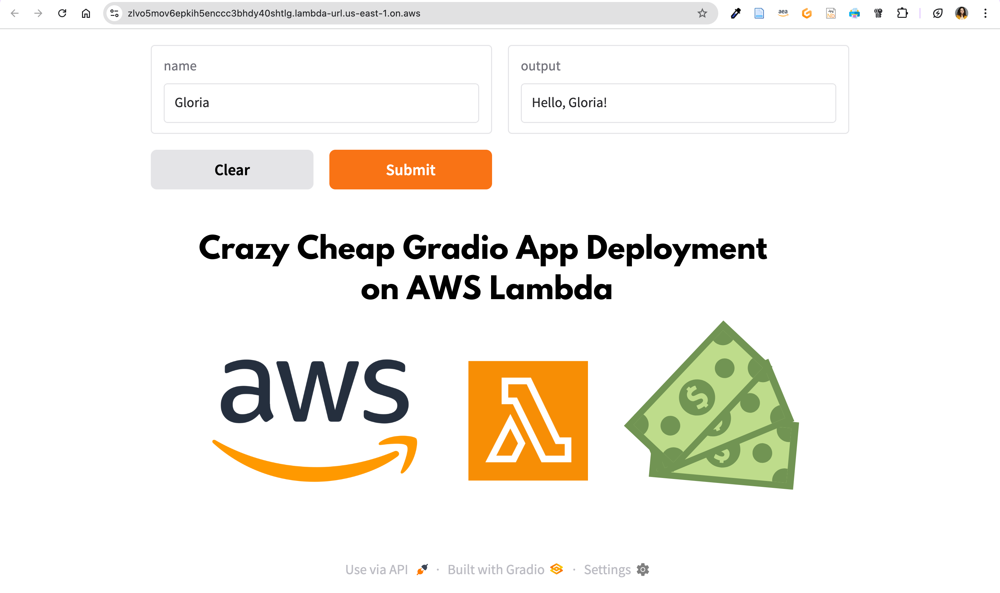

# **Gradio AWS Lambda Deployment with AWS CDK**

## **Overview**
This project deploys a **Gradio** application as an **AWS Lambda function** using **AWS CDK**. The Lambda function is packaged as a **Docker container** and exposed via a **public function URL**.



## **Main Idea**

This code builds a lightweight Docker container using Python 3.12-slim, sets up an environment optimized for AWS Lambda by including a Lambda web adapter, and installs required dependencies before running an application. The Python script defines a simple Gradio web interface where a function returns a greeting message based on user input.

Kudos to the [awslabs team](https://github.com/awslabs/aws-lambda-web-adapter) for creating the AWS Lambda Web Adapter. This project simply makes their work easier to use for Gradio.

## **Why is it interesting?**
Deploying a Gradio app on AWS Lambda is particularly compelling because it leverages a pay-per-use model that can substantially reduce costs for sporadic or low-traffic workloads. For instance, if the Gradio app is used by only 20 users for 5 minutes each over an entire month (totaling 100 minutes or 6,000 seconds of compute time), AWS Lambda’s pay-per-use model would cost roughly $0.01–$0.02 per month using a minimal 128 MB configuration, thanks to its per-second billing. In contrast, AWS App Runner’s always-on minimal instance (0.25 vCPU and 0.5 GB memory) would incur a fixed cost of about $14 per month regardless of actual usage, making Lambda significantly more cost-effective for such low-traffic scenarios.

## **Features**
- Deploys a **Dockerized** Gradio app to AWS Lambda.
- Uses **AWS CDK** for infrastructure as code (IaC).
- Provides a **public URL** to access the app.

---

## **Setup & Deployment**
### **1️⃣ Clone the Repository**
```sh
git clone https://github.com/your-repo-name.git
cd your-repo-name
```

### **2️⃣ Install Dependencies**
Create a virtual environment and install required packages:
```sh
python -m venv .venv
source .venv/bin/activate  # macOS/Linux
# OR
.venv\Scripts\activate  # Windows

pip install -r requirements.txt
```

### **3️⃣ Configure AWS Credentials**
Set up AWS credentials if not already configured:
```sh
aws configure
```
Or use a specific profile:
```sh
export AWS_PROFILE=your-profile  # macOS/Linux
set AWS_PROFILE=your-profile  # Windows CMD
```

### **4️⃣ Set Up Environment Variables**
Create a `.env` file and add:
```
AWS_ACCOUNT_ID=your-aws-account-id
AWS_REGION=your-aws-region
```

### **5️⃣ Bootstrap AWS CDK (First-Time Only)**
```sh
cdk bootstrap aws://$AWS_ACCOUNT_ID/$AWS_REGION
```

### **6️⃣ Deploy the Lambda Function**
```sh
cdk deploy
```
After deployment, the function’s **public URL** will be displayed in the output.

### **7️⃣ Test the Deployed Gradio App**
Once deployed, access the app by visiting the function URL.

### **8️⃣ Destroy the Stack (Optional)**
To remove all AWS resources:
```sh
cdk destroy
```
---

## **Future Work**

* Add streamlit support